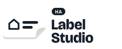

<p align="center">
  <picture>
    <source media="(prefers-color-scheme: dark)" srcset="images/logo-dark.svg">
    
  </picture>
</p>

<p align="center">
  Design and print labels on a USB DYMO LabelWriter, right from Home Assistant.
</p>

<p align="center">
  <a href="https://my.home-assistant.io/redirect/supervisor_add_addon_repository/?repository_url=https%3A%2F%2Fgithub.com%2Fmadeby0203%2Fha-label-studio"></a>
</p>

Label Studio is a Home Assistant app for DYMO LabelWriter printers. Design labels with a live preview, save them as templates, and print them from a dashboard button, an automation or a switch next to the fridge.

## Features

- **Label designer** with a live preview, five fonts, and text that wraps, hyphenates and resizes to fit the label.
- **Icons, emoji and QR codes**: search all Material Design Icons, place the image left, right, above or below the text.
- **Dynamic labels**: dates filled in when printing, and Home Assistant templates such as `{{ now().strftime('%d-%m') }}` or `{{ states('sensor.freezer_temperature') }}`.
- **Print buttons in Home Assistant**: every template becomes a button entity (through MQTT discovery), ready for dashboards and automations.
- **Every LabelWriter 400/450 label size**, with favourites and per-label print corrections.
- **Network printer** (optional): share the LabelWriter with your computers and phones over Bonjour/AirPrint.
- **Feels native**: the interface follows your Home Assistant theme, including dark mode and custom themes.

## Requirements

- Home Assistant OS or Supervised, on amd64 or aarch64 (for example a Raspberry Pi 4 or 5).
- A DYMO LabelWriter of the 400 or 450 series, connected by USB.
- Optional, for print buttons: an MQTT broker, such as the Mosquitto broker app.

## Installation

1. Click the **Add repository** button above, or add `https://github.com/madeby0203/ha-label-studio` as a repository in the app store yourself.
2. Install **Label Studio** and start it.
3. Open **Label Studio** from the sidebar.

The app's **Documentation** tab explains everything else; it is also in [label_studio/DOCS.md](label_studio/DOCS.md).

## Development

The app lives in [label_studio](label_studio). Run the tests with:

```sh
pip install -r label_studio/requirements.txt pytest
pytest tests
```

To render a label without Home Assistant, use `render_png.py`. Point `FONT_DIRS` (separated by `:`) at folders with the Roboto and DejaVu fonts, `NotoColorEmoji.ttf`, and the MDI webfont with its `materialdesignicons.css`; without them Pillow's built-in font is used and `mdi:` icons are unavailable.

```sh
cd label_studio
python3 render_png.py /tmp/label.png --text Milk --icon mdi:fridge --font roboto-condensed
```

Pushes to `main` build the app image for amd64 and aarch64 with GitHub Actions and publish it to `ghcr.io/madeby0203/ha-label-studio`. Raise `version` in [label_studio/config.yaml](label_studio/config.yaml) and add a [changelog](label_studio/CHANGELOG.md) entry for every release, so Home Assistant offers the update.

## License

[MIT](LICENSE)
